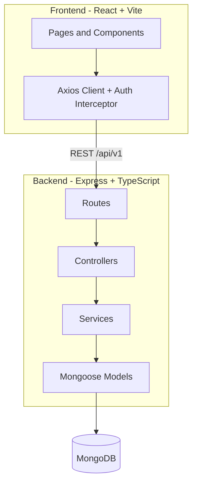

# PayTM Clone — Production-Hardened Full-Stack Wallet App

> **Live Demo:** _Deploy and add your URL here (Vercel + Render + MongoDB Atlas)_

A peer-to-peer money transfer application built with **React**, **TypeScript**, **Node.js**, **Express**, and **MongoDB**. This project takes the common tutorial PayTM clone and hardens it for production: bcrypt password hashing, JWT auth with expiry, transactional transfers, layered backend architecture, integration tests, CI/CD, and Docker support.

[](https://github.com/YOUR_USERNAME/not_paytm/actions/workflows/ci.yml)

## Why this project

Most bootcamp submissions ship the same PayTM clone with plaintext passwords and no tests. This version demonstrates **engineering maturity** suitable for SDE interviews:

- Security-first auth (bcrypt, helmet, rate limiting, env-based secrets)
- MongoDB **multi-document transactions** for money transfers
- **TypeScript** end-to-end with Zod validation
- **Jest + Supertest** integration tests on critical money paths
- **GitHub Actions** CI pipeline
- **Docker Compose** for one-command local setup

## Architecture



### Backend layers

| Layer | Responsibility |
|-------|----------------|
| `routes/` | HTTP routing, middleware attachment |
| `controllers/` | Request parsing, response formatting |
| `services/` | Business logic (auth, transfers) |
| `models/` | Mongoose schemas |
| `schemas/` | Zod validation (single source of truth) |

## Tech stack

| Area | Choices |
|------|---------|
| Frontend | React 18, TypeScript, Vite, Tailwind CSS, React Router |
| Backend | Node.js, Express, TypeScript, Mongoose, Zod |
| Auth | JWT (7-day expiry), bcrypt (10 salt rounds) |
| Testing | Jest + Supertest + mongodb-memory-server; Vitest + RTL |
| DevOps | GitHub Actions, Docker, Docker Compose |

## Getting started

### Prerequisites

- Node.js 20+
- MongoDB (local or Atlas)

### Local development

**1. Backend**

```bash
cd backend
cp .env.example .env   # edit MONGO_URL and JWT_SECRET
npm install
npm run dev
```

**2. Frontend**

```bash
cd frontend
cp .env.example .env
npm install
npm run dev
```

Open `http://localhost:5173`.

### Docker Compose

```bash
# Set a strong JWT_SECRET in your shell or .env at repo root
docker compose up --build
```

- Frontend: `http://localhost:5173`
- Backend: `http://localhost:3000`
- Health check: `GET http://localhost:3000/health`

## Environment variables

### Backend (`backend/.env`)

| Variable | Description |
|----------|-------------|
| `MONGO_URL` | MongoDB connection string |
| `JWT_SECRET` | Secret for signing JWTs (min 16 chars) |
| `PORT` | Server port (default 3000) |
| `FRONTEND_URL` | CORS origin (default `http://localhost:5173`) |

### Frontend (`frontend/.env`)

| Variable | Description |
|----------|-------------|
| `VITE_API_URL` | Backend API base URL |

## API reference

Base URL: `/api/v1`

| Method | Endpoint | Auth | Description |
|--------|----------|------|-------------|
| POST | `/user/signup` | No | Register user + create wallet |
| POST | `/user/signin` | No | Login, returns JWT |
| PUT | `/user/` | Yes | Update profile |
| GET | `/user/bulk?filter=` | No | Search users by name |
| GET | `/account/balance` | Yes | Get wallet balance |
| POST | `/account/transfer` | Yes | Transfer funds (transactional) |

## Testing

```bash
# Backend integration tests
cd backend && npm test

# Frontend unit tests
cd frontend && npm test

# Type checking
cd backend && npm run typecheck
cd frontend && npm run typecheck
```

## Deployment

### Recommended stack

1. **MongoDB Atlas** — free tier cluster
2. **Render / Railway / Fly.io** — backend (`npm run build && npm start`)
3. **Vercel / Netlify** — frontend (`npm run build`)

Set `VITE_API_URL` to your deployed backend URL at build time. Set `FRONTEND_URL` on the backend for CORS.

## Design decisions and trade-offs

| Decision | Rationale | Trade-off |
|----------|-----------|-----------|
| JWT in localStorage | Simple for a portfolio SPA | Vulnerable to XSS; httpOnly cookies would be more secure |
| MongoDB transactions | Atomic transfers prevent partial debits | Requires replica set (Atlas provides this) |
| Zod schemas | Shared validation + type inference | Slight boilerplate vs plain validators |
| Layered backend | Clear separation for testing and growth | More files than a tutorial monolith |
| bcrypt (10 rounds) | Industry-standard password hashing | Slower than plain compare (intentional) |

## Resume bullet examples

- Hardened a full-stack P2P wallet app: bcrypt auth, JWT expiry, rate limiting, and MongoDB transactional transfers
- Migrated MERN tutorial codebase to **TypeScript** with layered architecture (routes → controllers → services)
- Wrote **integration tests** for signup, auth, and money transfer edge cases using Jest + mongodb-memory-server
- Set up **GitHub Actions CI** and **Docker Compose** for reproducible builds and deployment

## License

ISC
